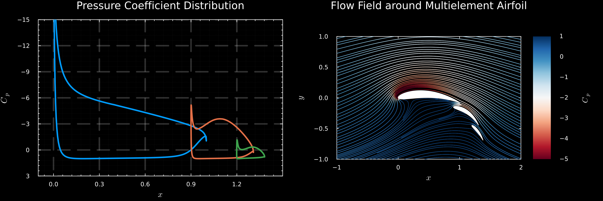

# AeroInviscid.jl

Lightweight 2D inviscid aerodynamics in Julia: linear vortex panel method for single and multi-element airfoils, plus plotting recipes for Cp and streamlines.



## Features

- Linear vortex-sheet panel solver for `Airfoil` and `MultielementAirfoil`
- Built-in plot recipes:
	- `plot(sol)` for pressure coefficient (Cp) distribution on the geometry
	- `flowplot(sol; ...)` for flow field visualization with streamlines
- Programmatic field evaluation with `induced_velocity(sol, X, Y)`
- Support for keyword arguments: `InviscidProblem(geom; alpha=α)`
- Multi-threaded velocity field computation for performance
- Comprehensive test suite validating against analytical solutions

## Quick start

### Single airfoil

```julia
using AeroGeometry
using AeroInviscid
using Plots

af = Airfoil("NACA6412")
prob = InviscidProblem(af, alpha=10.0)    # α = 10 degrees
sol = solve(prob)

# Cp distribution
plot(sol, title="Pressure Coefficient", xlabel="x", ylabel="C_p")

# Flow visualization
flowplot(sol; xlims=(-1, 2), ylims=(-1, 1), 
         min_density=2, max_density=10, linewidth=1.0, clims=(-5, 1))
```

### Multi-element airfoil

```julia
using AeroGeometry
using AeroInviscid
using Plots
using LaTeXStrings

airfoils = [Airfoil("NACA$i") for i in ["6412", "8412", "4412"]]
chord   = [1.0, 0.5, 0.3]
pitch   = [0.0, 30.0, 50.0]
le_loc  = [[0.0, 0.0], [0.9, -0.15], [1.2, -0.45]]

me = MultielementAirfoil(airfoils, pitch, chord, le_loc)
prob = InviscidProblem(me, alpha=0.0)
sol = solve(prob)

p1 = plot(sol, title="Pressure Coefficient Distribution", xlabel=L"x", ylabel=L"C_p")
xlims!(p1, -1, 2.6); ylims!(p1, -15, 3)

p2 = flowplot(sol, title="Flow Field around Multielement Airfoil", xlabel=L"x", ylabel=L"y")

plot(p1, p2, layout=(2,1), size=(800, 1000))
```

The file `scripts/MultiElement.jl` contains a full, runnable example that generates the image shown above.
